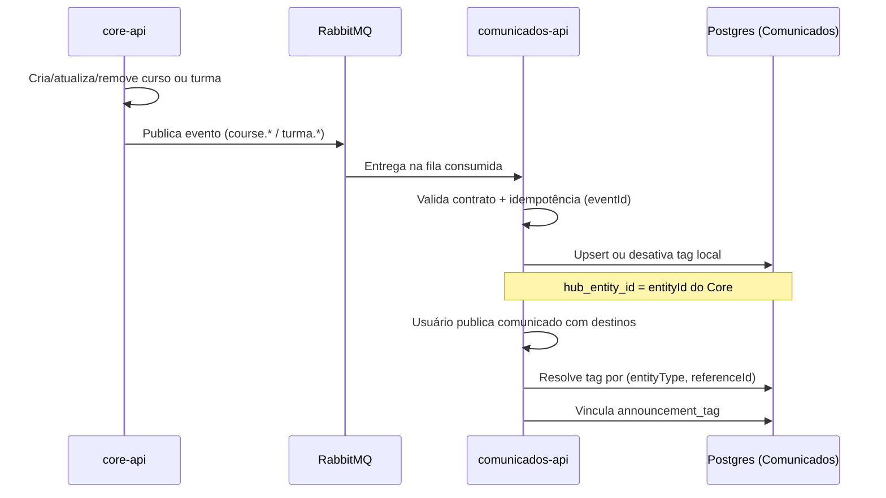

# Tags por eventos — Core → Comunicados

Documento de referência para sincronização de **tags** a partir de eventos publicados pelo **Core** e para **auto-vinculação** dessas tags aos comunicados conforme os **destinos** selecionados na criação/publicação.

> **Fonte:** contrato acordado entre Core e Comunicados (*Criação de tags por eventos*, jun/2026).  
> **Documento legado:** [`core-entity-events.md`](./core-entity-events.md) descreve um envelope anterior — será substituído por este contrato após alinhamento (#142+).

---

## 1. Visão geral

### Por que eventos?

Tags de comunicados representam **filtros e classificações** usados para organizar público e conteúdo. Cursos e turmas pertencem ao domínio central do **Core**; o **comunicados-api** não deve:

- consultar diretamente o banco do Core;
- recriar regras de negócio de curso ou turma.

Quando uma ação relevante ocorre no Core, ele publica um evento no **RabbitMQ**. O Comunicados consome e **materializa a tag localmente**.

### Fluxo



### Responsabilidades

| Componente | Responsabilidade |
|------------|------------------|
| **core-api** | Executar regra de negócio; publicar evento **após** ação concluída; enviar campos mínimos; não enviar detalhes internos de persistência |
| **RabbitMQ** | Entregar eventos; permitir reprocessamento em falha temporária |
| **comunicados-api** | Consumir eventos; validar contrato; criar/atualizar/desativar tags; idempotência; **não** acessar banco do Core |

---

## 2. Contrato de mensageria (oficial)

### Padrão de nomenclatura

```
entidade.acao
```

| eventType | Ação no Comunicados |
|-----------|---------------------|
| `course.created` | Criar tag `COURSE` |
| `course.updated` | Atualizar tag `COURSE` |
| `course.deleted` | Desativar/remover tag `COURSE` |
| `turma.created` | Criar tag `CLASS`* |
| `turma.deleted` | Desativar/remover tag `CLASS`* |

\* No domínio de **destinos** do comunicado o tipo continua `CLASS` (API REST). No **contrato de eventos** usa-se **`turma`**, não `class`, conforme vocabulário do Portal Conecta.

> **Turma não gera `turma.updated`:** turma não é editável para fins de tag neste fluxo.

### Payload mínimo (envelope plano)

Todo evento deve conter:

| Campo | Obrigatório | Descrição |
|-------|-------------|-----------|
| `eventId` | Sim | UUID único por publicação (idempotência) |
| `correlationId` | Sim | Rastreio entre serviços |
| `source` | Sim | Ex.: `core-api` |
| `eventType` | Sim | Ex.: `course.created` |
| `occurredAt` | Sim | ISO-8601 |
| `entityType` | Sim | `course` ou `turma` |
| `entityId` | Sim | UUID estável no Core → vira `tag.hub_entity_id` |
| `name` | Upsert | Nome de exibição da tag |
| `code` | Curso | Código do curso (alternativa/complemento a `name`) |

### Exemplos

**Curso criado:**

```json
{
  "eventId": "evt-01JYTAGCOURSECREATED",
  "correlationId": "corr-01JYTAGCOURSECREATED",
  "source": "core-api",
  "eventType": "course.created",
  "occurredAt": "2026-06-19T18:00:00Z",
  "entityType": "course",
  "entityId": "course-123",
  "code": "MIDS",
  "name": "MIDS"
}
```

**Curso atualizado:**

```json
{
  "eventId": "evt-01JYTAGCOURSEUPDATED",
  "correlationId": "corr-01JYTAGCOURSEUPDATED",
  "source": "core-api",
  "eventType": "course.updated",
  "occurredAt": "2026-06-19T18:10:00Z",
  "entityType": "course",
  "entityId": "course-123",
  "code": "MIDS",
  "name": "MIDS"
}
```

**Curso removido:**

```json
{
  "eventId": "evt-01JYTAGCOURSEDELETED",
  "correlationId": "corr-01JYTAGCOURSEDELETED",
  "source": "core-api",
  "eventType": "course.deleted",
  "occurredAt": "2026-06-19T18:20:00Z",
  "entityType": "course",
  "entityId": "course-123",
  "code": "MIDS"
}
```

**Turma criada:**

```json
{
  "eventId": "evt-01JYTAGTURMACREATED",
  "correlationId": "corr-01JYTAGTURMACREATED",
  "source": "core-api",
  "eventType": "turma.created",
  "occurredAt": "2026-06-19T18:30:00Z",
  "entityType": "turma",
  "entityId": "turma-78",
  "name": "MIDS-78"
}
```

**Turma removida:**

```json
{
  "eventId": "evt-01JYTAGTURMADELETED",
  "correlationId": "corr-01JYTAGTURMADELETED",
  "source": "core-api",
  "eventType": "turma.deleted",
  "occurredAt": "2026-06-19T18:40:00Z",
  "entityType": "turma",
  "entityId": "turma-78",
  "name": "MIDS-78"
}
```

### Regras gerais

- Toda entidade central usada como tag deve ter evento publicado pelo Core.
- Eventos inválidos **não** devem criar tags parciais → mensagem vai para **DLQ**.
- Eventos duplicados (`eventId` já processado) são **ignorados** (tabela `processed_event`).
- Chave natural da tag: `(entity_type, hub_entity_id)`.
- `entityId` do evento = `reference_id` do destino do comunicado = `hub_entity_id` da tag.

---

## 3. Modelo local de tags (Comunicados)

### Tabela `tag`

| Coluna | Origem |
|--------|--------|
| `id` | UUID gerado pelo Comunicados |
| `name` | `name` ou `code` do evento |
| `entity_type` | `COURSE`, `CLASS`, `USER`, `GENERAL` |
| `hub_entity_id` | `entityId` do Core (null para `GENERAL`) |
| `active` | `false` em eventos `*.deleted` |

### Mapeamento evento → `TagEntityType`

| `entityType` (evento) | `TagEntityType` (banco) | Destino API (`AnnouncementDestinationType`) |
|-----------------------|-------------------------|---------------------------------------------|
| `course` | `COURSE` | `COURSE` |
| `turma` | `CLASS` | `CLASS` |
| — | `USER` | `USER` (ver §5) |
| — | `GENERAL` | `GENERAL` (ver §5) |

---

## 4. Auto-vinculação na criação de comunicados

Ao **publicar** (`POST /api/posts/publish`) ou **agendar** (`POST /api/posts/schedule`), o Comunicados deve vincular automaticamente as tags correspondentes aos **destinos** informados.

### Regra

Para cada destino do comunicado:

| Tipo destino | `referenceId` | Tag resolvida |
|--------------|---------------|---------------|
| `CLASS` | UUID da turma | Tag ativa com `entity_type=CLASS` e `hub_entity_id=referenceId` |
| `COURSE` | UUID do curso | Tag ativa com `entity_type=COURSE` e `hub_entity_id=referenceId` |
| `USER` | UUID do usuário | Tag ativa com `entity_type=USER` e `hub_entity_id=referenceId` |
| `GENERAL` | `null` | Tag ativa singleton `entity_type=GENERAL` |

### Onde já existe

- `AutoLinkTagsByDestinationUseCase` — chamado em `PublishAnnouncementUseCase` e `ScheduleAnnouncementUseCase`.
- Mapeamento atual: `CLASS`, `COURSE`, `GENERAL` (**falta `USER`**).
- Tags explícitas via `tagIds` no body **ainda não são persistidas** no fluxo publish/schedule.

### Comportamento esperado (completo)

1. Persistir destinos normalmente em `announcement_destination`.
2. Para cada destino, resolver tag local pela chave `(entity_type, hub_entity_id)`.
3. Criar vínculos em `announcement_tag` (sem duplicar).
4. Mesclar com `tagIds` explícitos enviados no request (se houver).
5. Se tag não existir (evento ainda não consumido), **logar** e seguir — não falhar a publicação; front pode exibir aviso ou retentar sync posterior.
6. Na **edição** (`PUT /api/posts/{id}`), re-sincronizar tags quando destinos mudarem.

### Uso em filtros

Tags vinculadas permitem:

- `GET /api/posts?tagId={uuid}` — filtrar comunicados por tag
- `GET /api/posts?tagIds={uuid1},{uuid2}` — múltiplas tags (a definir)
- Busca textual existente (`search`) continua incluindo nome da tag

---

## 5. Escopo futuro: usuário e geral

O contrato PDF inicial cobre **curso** e **turma**. Para destinos `USER` e `GENERAL`:

| Destino | Proposta |
|---------|----------|
| **USER** | Core publica `user.created` / `user.updated` / `user.deleted` (contrato a formalizar) **ou** tag criada na primeira matrícula do usuário em turma |
| **GENERAL** | Tag singleton criada via migration/seed local (`hub_entity_id = null`); não depende de evento Core |

Esses pontos estão nas tasks #147 e #148.

---

## 6. Gap: implementação atual vs contrato oficial

| Aspecto | Contrato oficial (PDF) | Implementação atual |
|---------|------------------------|---------------------|
| Formato envelope | Campos na raiz | Objeto aninhado `payload` |
| `eventType` | `course.created`, `turma.created` | `core.course.created`, `core.class.created` |
| Remoção | `*.deleted` | `*.deactivated` |
| Vocabulário turma | `turma` | `class` / `CLASS` |
| `correlationId` | Obrigatório | Ausente |
| Auto-link `USER` | Necessário | Não implementado |
| `tagIds` no publish | Mesclar com auto-link | Campo existe, não wired |
| Filtro por tag na listagem | Necessário para produto | Não implementado |
| Re-sync tags no PUT | Necessário | Não implementado |

---

## 7. Infraestrutura RabbitMQ (referência)

Configuração atual em `application.yaml` (pode ser ajustada no alinhamento):

| Item | Valor sugerido |
|------|----------------|
| Exchange | `portal.core.events` (topic) |
| Queue Comunicados | `comunicados.core-entities` |
| DLQ | `comunicados.core-entities.dlq` |
| Routing keys | `course.#`, `turma.#` (atualizar de `core.class.#`) |
| Feature flag | `MESSAGING_ENABLED=true` |

---

## 8. Critérios de aceite (história de tags)

- [ ] Core publica eventos conforme §2 após CRUD de curso/turma
- [ ] Comunicados consome e materializa tags idempotentemente
- [ ] Publicar/agendar comunicado auto-vincula tags de todos os destinos
- [ ] Listagem suporta filtro por tag
- [ ] Documentação legada (`core-entity-events.md`) atualizada ou deprecada
- [ ] Testes automatizados: consumer, auto-link, filtro

---

## 9. Referências

- Issue história: [#10](https://github.com/Portal-Conecta/comunicados-backend/issues/10)
- Fluxo tags: [#93](https://github.com/Portal-Conecta/comunicados-backend/issues/93)
- Sync RabbitMQ: [#113](https://github.com/Portal-Conecta/comunicados-backend/issues/113)
- Auto-vinculação: [#110](https://github.com/Portal-Conecta/comunicados-backend/issues/110) (se existir)
- Código: `CoreEntityTagConsumer`, `AutoLinkTagsByDestinationUseCase`, `TagController`
